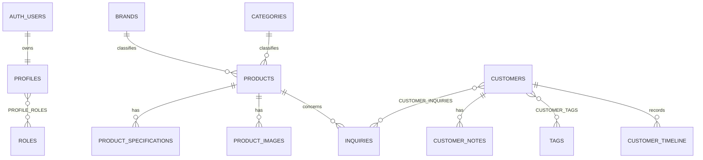

# Database schema

## Relationship overview

## Table catalogue

| Table | Purpose and key relations | Uniqueness/indexes | Delete behavior | RLS / sensitivity |
|---|---|---|---|---|
| `profiles` | Auth-linked staff profile | PK=`auth.users.id`, email | cascades with Auth user | self/super-admin; confidential |
| `roles`, `profile_roles` | additive authorization | role code; composite assignment | role restrict, profile cascade | viewer read, super-admin write |
| `brands`, `categories` | catalog reference data | slug and case-insensitive name | product FK restrict | active public read; catalog write |
| `products` | catalogue source of truth | slug; case-insensitive SKU; status/brand/category indexes | parent for catalog children | published public read; catalog write |
| `product_specifications` | ordered key/value facts | product+key | cascade with product | follows published/admin catalog access |
| `product_images` | bucket/path media metadata | bucket+path; one active cover; product/order | cascade with product; showroom has no product | approved public read; media write |
| `product_status_history` | status transitions | product/date access | cascade with product | admin read; catalog insert |
| `inquiries` | contact/availability requests | public reference; email/status indexes | product/profile set null; CRM link restrict | anonymous insert only; CRM access; highly confidential |
| `customers` | deduplicated CRM identity | normalized email; status/activity | CRM parent | CRM access; highly confidential |
| `customer_inquiries` | preserved inquiry links | composite PK | customer cascade, inquiry restrict | CRM access; confidential |
| `customer_notes` | soft-deletable notes | customer/date | customer cascade | CRM access; highly confidential |
| `tags`, `customer_tags` | normalized labels | normalized name/composite PK | tag restrict, customer cascade | CRM access |
| `customer_timeline` | safe event summaries | customer/date | customer cascade | CRM access; do not duplicate sensitive bodies |
| `collection_settings` | singleton public presentation settings | key=`default` | no dependent delete | public read, super-admin write |
| `admin_audit_log` | tamper-resistant admin events | actor/date | actor set null | super-admin read, controlled insert; confidential |
| `import_jobs` | import state/summary, not payload | status/date | actor set null | super-admin only; confidential |

Email normalization is `lower(btrim(email))`. Only exact normalized-email matches merge automatically; phone-only matches require reviewed manual merge. Browser-specific density remains local/profile preference, not `collection_settings`.
